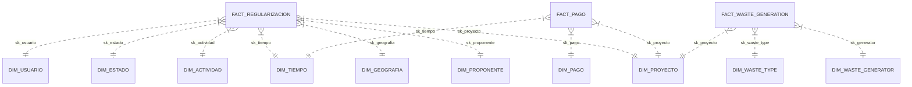

# Arquitectura del Data Warehouse: Regularización Ambiental

Esta sección detalla la arquitectura técnica y el diseño lógico del Data Warehouse (DWH) implementado para el sistema de Regularización Ambiental.

## 1. Modelo de Datos Dimensional (Star Schema)

El DWH utiliza un diseño de **Esquema Estrella** centrado en el esquema `dw`. Este modelo separa los datos en tablas de hechos (eventos cuantificables) y dimensiones (contexto descriptivo).

### Diagrama General (Conceptual)

## 2. Capas de Datos

La arquitectura se divide en dos capas lógicas dentro de la base de datos PostgreSQL `dw_reg_v1`:

### 2.1. Capa de STAGING (`stg`)
*   **Propósito:** Área de aterrizaje y preparación de datos.
*   **Características:** 
    *   Mantiene copias 1:1 de las fuentes de origen (SUIA, COA, JBPM).
    *   No tiene restricciones de integridad referencial para acelerar la ingesta.
    *   Incluye tablas unificadas como `stg.consolidado_proyectos`.
*   **Tablas Clave:** `suia_coa_bi`, `suia_rcoa_bi`, `consolidado_proyectos`, `stg_waste_generator`, etc.

### 2.2. Capa de DATA WAREHOUSE (`dw`)
*   **Propósito:** Capa de consumo para reportería y BI.
*   **Características:** 
    *   Esquema normalizado dimensionalmente.
    *   Uso de **Claves Surrogadas** (`sk_*`) de tipo `SERIAL` para independizar el DWH de cambios en las claves de las fuentes.
    *   Implementación de **Slowly Changing Dimensions (SCD) Tipo 2** en dimensiones críticas para mantener historial (ej: `dim_proyecto`).

## 3. Estrategia de Integridad y Calidad

### 3.1. Registros de Identidad (SK=0)
Cada dimensión incluye un registro con `sk_* = 0` (habitualmente con valores 'N/A' o 'DESCONOCIDO'). Esto asegura que:
- Los `INNER JOIN` entre hechos y dimensiones no descarten registros por falta de correspondencia.
- Se mantenga la integridad referencial incluso si la fuente tiene datos incompletos.

### 3.2. Deduplicación Masiva
El DWH emplea la cláusula `DISTINCT ON` combinada con `ORDER BY date_update DESC` durante la carga de dimensiones para asegurar que solo la versión más reciente de una entidad sea la "vigente", manejando conflictos mediante `ON CONFLICT DO UPDATE`.

### 3.3. Optimización de Búsqueda
Para la integración de módulos transversales (como Residuos), se utiliza una tabla temporal optimizada (`tmp_dim_proyecto_optimized`) que extrae el sufijo numérico del código de proyecto, permitiendo un rendimiento de alta velocidad en el mapeo de hechos.
