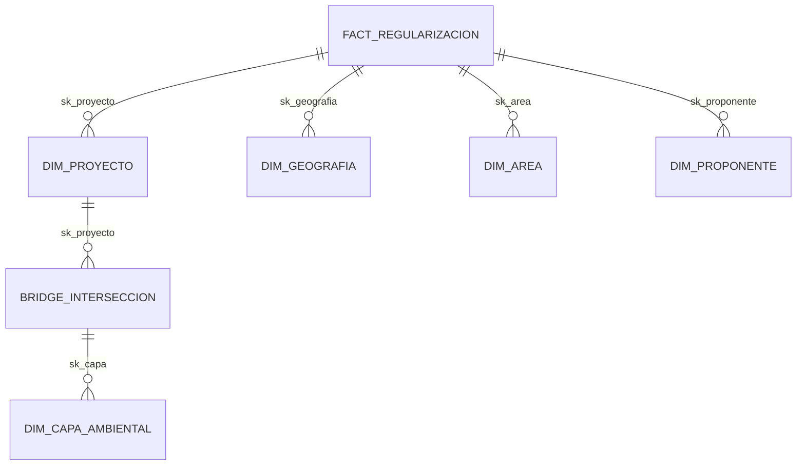

# Especificación Técnica: Módulo de Superposición Ambiental

Este documento proporciona una vista completa de las tablas, relaciones y definiciones de negocio que integran el análisis de intersección en el Dashboard RA.

---

## 1. Modelo de Datos (Arquitectura)
El módulo utiliza una estructura de **Esquema Estrella** con una **Tabla Puente** para manejar relaciones *Muchos-a-Muchos* entre proyectos y capas ambientales.

### 1.1 Diagrama de Relación

---

## 2. Detalle de Tablas

### 2.1 Tabla de Hechos: `dw.fact_regularizacion`
Es el núcleo del DWH. Almacena cada hito de los trámites.
- **`sk_proyecto`**: Llave de enlace al maestro de proyectos.
- **`sk_geografia`**: Llave de ubicación (Provincia/Cantón/Parroquia).
- **`sk_area`**: Referencia a la Oficina Técnica responsable.
- **`interseccion_snap`**: Campo de texto con el resumen de intersecciones del sistema origen.
- **`fecha_inicio_proceso`**: Fecha crucial para determinar el registro más reciente.

### 2.2 Tabla Puente: `dw.bridge_interseccion_ambiental`
Permite que un proyecto esté en múltiples zonas sensibles simultáneamente.
- **`sk_proyecto`**: Llave del proyecto.
- **`sk_capa`**: Llave de la capa ambiental (Bosque, SNAP, etc.).
- **`detalle_interseccion`**: Texto descriptivo del cruce específico.

### 2.3 Dimensiones Críticas

#### `dw.dim_proyecto`
- **`codigo_proyecto`**: ID único (ej. MAATE-RA-2024-...).
- **`nombre_proyecto`**: Descripción legal del proyecto.
- **`tipo_permiso_ambiental`**: Categorización (Licencia, Registro, Certificado).

#### `dw.dim_capa_ambiental`
- **`nombre_capa`**: Etiqueta oficial (ej. "Área Protegida", "Bosque Protector").
- **`tipo_capa`**: Clasificación (Privada, Estatal, etc.).

#### `dw.dim_geografia`
- **`provincia`, `canton`, `parroquia`**: Jerarquía administrativa completa.

#### `dw.dim_area`
- **`nombre_area`**: Nombre de la Oficina Técnica (ej. "Oficina Técnica Guayaquil").
- **`zona`**: Zona administrativa regional.

---

## 3. Lógica de Negocio
1. **Detección de Intersección**: Un proyecto se considera "Interseca" si existe al menos un registro en `bridge_interseccion_ambiental` O si el campo `interseccion_snap` de la fact table contiene información de cruce.
2. **Consolidación (Flattening)**: Para la tabla de resultados, las múltiples capas del bridge se agrupan en un solo campo de texto separado por comas (`string_agg`).

---

## 4. Visualización de Resultados y Búsqueda

### 4.1 Ficha de Detalle Ambiental (Jerarquía de Riesgo)
Para mejorar la toma de decisiones, las capas intersecadas se presentan con la siguiente jerarquía visual:

| Nivel de Riesgo | Color (UI) | Criterios (Nombre de Capa) | Importancia |
| :--- | :--- | :--- | :--- |
| **Crítico (Rojo)** | `st.error` | SNAP, Áreas Protegidas, Áreas Pobladas | 1 |
| **Importante (Amarillo)** | `st.warning` | Bosques Protectores, Ecosistemas Frágiles | 2 |
| **Informativo (Azul)** | `st.info` | Nombres genéricos de capas registradas | 3 |

Esta ficha se activa automáticamente al ingresar un código de proyecto en el buscador de la pestaña **Gestión (6)** o **Superposición (7)**, extrayendo los datos en tiempo real de la tabla `/dw.bridge_interseccion_ambiental`.

---
*Manual técnico generado para el equipo de Calidad y Desarrollo.*
