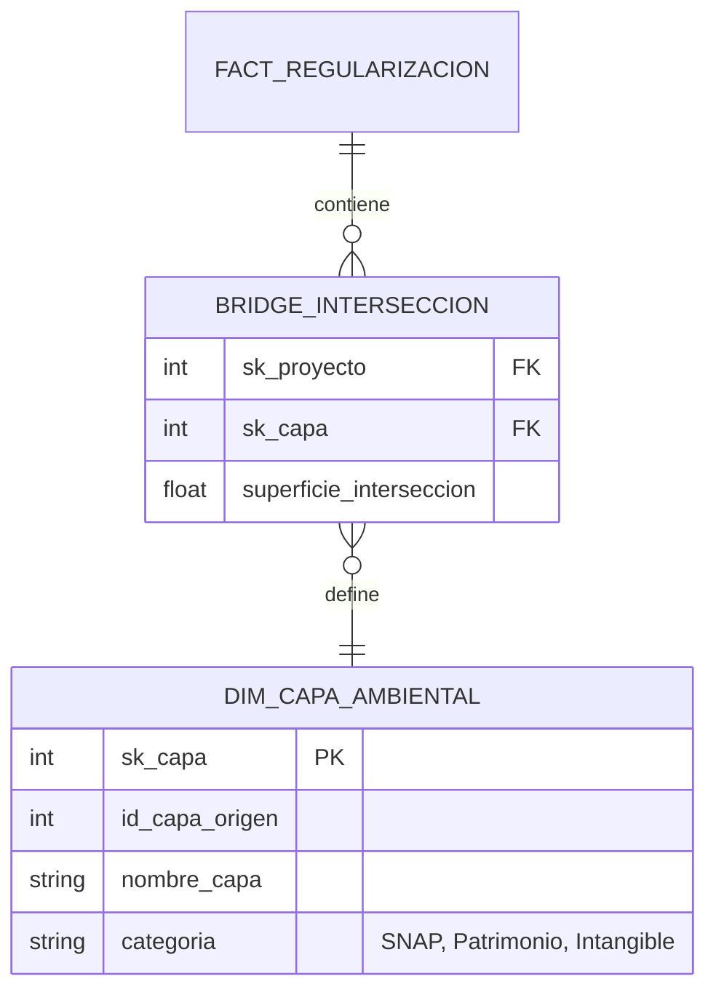

# Análisis de Arquitectura: Intersecciones de Biodiversidad (v1.4)
**Evaluación de Funciones de Origen y Propuesta de Normalización Dimensional**

---

## 1. Diagnóstico de Funciones de Origen
Tras el análisis exhaustivo de los scripts `sp_coa_bi.sql` y `sp_rcoa_bi.sql` en el entorno de producción, se identifican hallazgos críticos de ingeniería de datos:

### 1.1. Restricción Operativa (Hardcoding)
Ambas funciones de extracción poseen un filtro rígido sobre la tabla de intersecciones geográfica:
- **Filtro Actual**: `laye_id = 3`.
- **Impacto**: La columna `AREAS PROTEGIDAS` solo captura el **SNAP**. Se ignoran sistemáticamente el Patrimonio Forestal y las Zonas Intangibles.

### 1.2. Mapeo de Capas Identificadas (Servidor 172.16.0.179)
Mediante consulta forense al catálogo de capas (`suia_iii.layers`), se ha recuperado el diccionario real de intersecciones:

| ID Capa | Nombre de Capa | Intersecciones (suia_iii) | Estado en ETL actual |
| :--- | :--- | :--- | :--- |
| **3** | SNAP | ~28,415 | **CAPTURADO** |
| **2** | Zonas Intangibles | ~5,217 | **OMITIDO** |
| **11** | Patrimonio Forestal del Estado | ~94,670 | **OMITIDO** |
| **4** | Bosques Protectores | ~13,745 | **OMITIDO** |

> [!WARNING]
> **Brecha de Datos**: Se están perdiendo aproximadamente **113,632 registros** de intersección de biodiversidad debido a la arquitectura actual de las funciones de carga.

---

## 2. Propuesta de Arquitectura Dimensional
Para resolver esta brecha y permitir un análisis multinivel de impacto ambiental, se propone la creación de una nueva estructura dimensional.

### 2.1. ¿Nueva Dimensión o Columna?
**Decisión**: NUEVA DIMENSIÓN Y PUENTE (Many-to-Many).
Un proyecto puede intersecar simultáneamente con SNAP y Patrimonio Forestal. Almacenarlo como texto consolidado impide el análisis por categorías.

### 2.2. Diseño de Tablas Propuesto

---

## 3. Hoja de Ruta para la Implementación

1.  **Refactorización de SPs**: Modificar `sp_coa_bi` y `sp_rcoa_bi` para capturar `laye_id` IN (2, 3, 4, 11).
2.  **Creación de DDL**: Implementar las nuevas tablas `dw.dim_capa_ambiental` y el puente de intersección.
3.  **Ajuste de Pentaho**: Actualizar las transformaciones para que el flujo de carga pueble la tabla puente de forma incremental.

---
**Ingeniero de Datos**: Antigravity AI
**Estado del Análisis**: Finalizado / Pendiente de Aprobación de Arquitectura
**Fecha**: 2026-03-10
