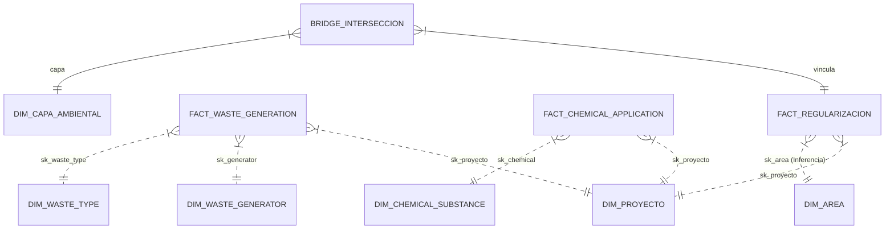

# 🏗️ Arquitectura Integral: Data Warehouse Regularización Ambiental (v1.5.1)

**Visión Estratégica, Modelo de Datos Extendido y Gobernanza de Información**

---

## 1. Visión Holística del Ecosistema
El Data Warehouse de Regularización Ambiental ha evolucionado hacia una arquitectura híbrida y escalable. La **Versión 1.5** consolida no solo los procesos de regularización y flujos financieros, sino también el monitoreo especializado de **Residuos Peligrosos** y **Sustancias Químicas**.

### Objetivos Actualizados
- **Consolidación Multifuente (SSOT):** Integración de SUIA, RCOA, JBPM y COA.
- **Rendimiento de Alta Velocidad:** Implementación de optimizaciones para cargas masivas (>470k hechos).
- **Integridad Referencial Blindada:** Uso sistemático de registros `SK=0`.

---

## 2. Arquitectura de Capas (Data Flow)

La arquitectura se organiza en una estructura de "Medallón" optimizada para PostgreSQL:

### 🥉 Capa 1: Staging (stg)
Zona de persistencia temporal y aterrizaje crudo.
- **Fuentes Remotas:** SUIA, ENLISY, JBPM.
- **Fuentes Locales/Nuevas:** COA (Residuos y Químicos).
- **Refactorización v1.5:** Inclusión de tablas de metadatos dinámicos para flexibilidad de esquemas.

### 🥈 Capa 2: Data Warehouse (dw)
Modelo estrella orquestado para analítica avanzada.
- **Dimensiones:** Entidades que proporcionan contexto (Proyecto, Proponente, Geografía, Residuos).
- **Hechos (Facts):** Eventos transaccionales (Regularización, Pagos, Generación de Residuos, Aplicación Química).

### 🥇 Capa 3: Referencia (ref)
Catálogos maestros e inteligencia de negocio externa.
- **INEC DPA 2024:** Geografía política oficial.
- **Motor de Inferencia:** Fallbacks expertos para corregir anomalías de origen.

---

## 3. Matriz Técnica de Linaje (Lineage v1.5)

| N° | Entidad de Negocio | Fuente de Origen (Sistema) | Tabla Staging | Tabla Destino Final (DWH) |
| :--- | :--- | :--- | :--- | :--- |
| 1 | Proyectos RCOA | `coa_mae.tmp_rcoa_bi` | `stg.suia_rcoa_bi` | `dw.fact_regularizacion` |
| 2 | Proyectos SUIA | `suia_iii.tmp_coa_bi` | `stg.suia_coa_bi` | `dw.fact_regularizacion` |
| 3 | Pagos JBPM | `online_payments` | `stg.jbpm_pagos_bi` | `dw.fact_pago` |
| 4 | Pagos SUIA | `financial_transaction` | `stg.suia_pagos_bi` | `dw.fact_pago` |
| 5 | Intersección SNAP | `variableinstancelog` | `stg.suia_snap_bi` | `dw.bridge_interseccion_ambiental` |
| 6 | **Generación Residuos** | `waste_generator_record_coa` | `stg.stg_fact_waste_generation` | `dw.fact_waste_generation` |
| 7 | **Sustancias Químicas** | `products_pqa / chemical_substance_record` | `stg.stg_fact_chemical_application` | `dw.fact_chemical_application` |
| 8 | Geografía Política | `geographical_locations` | `stg.geographical_locations_bi` | `dw.dim_geografia` |

---

## 4. Diseño del Modelo Estrella (Visualización)

---

## 5. Estrategias de Optimización y Calidad

### 5.1 Pre-calculado de IDs (Performance)
Para la carga de hechos masivos, el sistema utiliza la tabla `stg.tmp_dim_proyecto_optimized` que indexa el sufijo numérico de los códigos SUIA, permitiendo joins de alta velocidad (O(log n) vs O(n^2)).

### 5.2 Deduplicación Inteligente
Uso de `DISTINCT ON` en las dimensiones para garantizar que solo el registro con la fecha de actualización más reciente (`date_update`) persista, evitando colisiones de llaves primarias y duplicidad analítica.

### 5.3 Blindaje de Nulos
Asignación de `SK=0` mediante `COALESCE` durante la carga de hechos, garantizando que el dashboard siempre muestre datos, incluso si el contexto (dimensión) falta en el origen.

---

**Arquitecto de Datos e Inteligencia Artificial:** Antigravity AI  
**Versión:** 1.5.1 (Remediación SQL)  
**Fecha de Actualización:** 2026-03-12  
**Estado:** Consolidado
