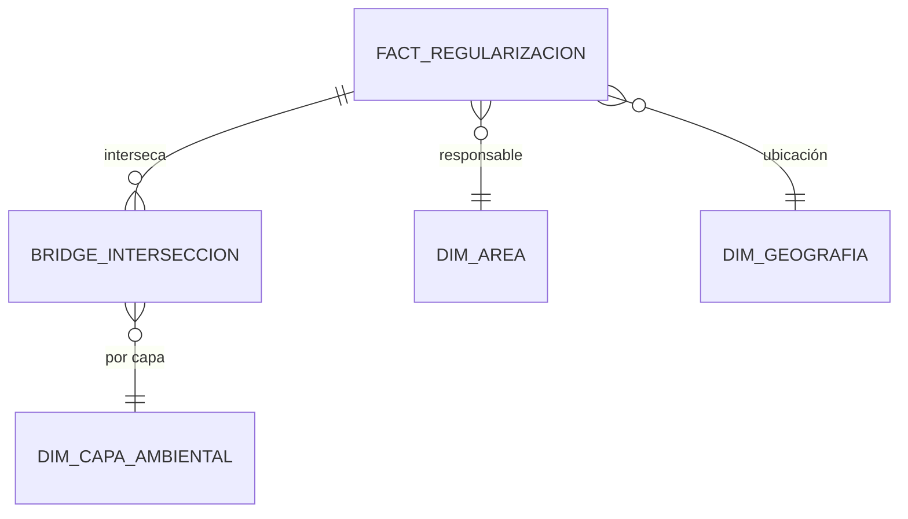

# Presentación Ejecutiva y Técnica: Data Warehouse Regularización Ambiental (v1.4)
**Arquitectura de Datos, Mapeo Masivo y Procedimientos Operativos**

---

## 1. Visión General del Proyecto
### Objetivo Estratégico
Consolidar la información de regularización ambiental dispersa en múltiples fuentes (SUIA, RCOA, JBPM) en una única "Versión de la Verdad" (SSOT).

### KPI de Madurez v1.4
- **Paridad Geográfica**: 100% (Resolución de brechas mediante Motor de Inferencia).
- **Integridad Referencial**: Blindaje mediante inicialización de registros maestro (SK=0).

---

## 2. Arquitectura de Datos (E-T-L)

### Capa 1: Staging (stg)
La zona de aterrizaje cruda donde se capturan las fuentes principales. En la versión 1.4.1, se ha refactorizado la captura de biodiversidad para incluir:
- **SNAP** (Laye_ID 3)
- **Zonas Intangibles** (Laye_ID 2)
- **Patrimonio Forestal** (Laye_ID 11)
- **Bosques Protectores** (Laye_ID 4)

### Capa 2: Data Warehouse (dw)
Modelo estrella robusto.
- **Novedad v1.4.1**: Introducción de la `dim_capa_ambiental` y `bridge_interseccion_ambiental`.
- Este modelo puente permite que un solo proyecto reporte impactos en múltiples áreas protegidas o bosques simultáneamente sin duplicar hechos financieros.

### Capa 3: Referencia (ref)
Catálogos maestros (INEC DPA 2024) y diccionarios de inferencia.

### 2.2. Matriz Técnica de Origen y Destino de Información

| N° | Fuente de Información (Origen) | Staging Area (Destino Temporal) | Data Warehouse (Destino Final) | Proceso / Referencia Técnica |
| :--- | :--- | :--- | :--- | :--- |
| 1 | `coa_mae.tmp_rcoa_bi` | `stg.suia_rcoa_bi` | `dw.fact_regularizacion` | TRX_01: Ingesta SUIA RCOA |
| 2 | `suia_iii.tmp_coa_bi` | `stg.suia_coa_bi` | `dw.fact_regularizacion` | TRX_02: Ingesta SUIA COA |
| 3 | `vm_sector_subsector_bi` | `stg.jbpm_sector_bi` | `dw.dim_actividad` | TRX_03: Ingesta JBPM Sector |
| 4 | `vm_cuatro_categorias_bi` | `stg.jbpm_categorias_bi` | `dw.dim_actividad` | TRX_04: Ingesta JBPM Categorías |
| 5 | `vwt_hidrocarbonos_bi` | `stg.jbpm_hidrocarburos_bi` | `dw.fact_regularizacion` | TRX_05: Ingesta JBPM Hidrocarburos |
| 6 | `variableinstancelog` (SNAP) | `stg.suia_snap_bi` | `dw.fact_regularizacion` | TRX_10: Ingesta SNAP (HTML) |
| 7 | `online_payments` | `stg.jbpm_pagos_bi` | `dw.fact_pago` | TRX_07: Ingesta Pagos JBPM |
| 8 | `financial_transaction` | `stg.suia_pagos_bi` | `dw.fact_pago` | TRX_08: Ingesta Pagos SUIA |
| 9 | `public.areas` | `stg.suia_areas_bi` | `dw.dim_area` | TRX_10: Areas (Expert Logic) |
| 10 | `geographical_locations` | `stg.geographical_locations_bi` | `dw.dim_geografia` | TRX_11: Geografía (DPA INEC) |

---

## 3. Procedimientos Operativos Detallados

### 3.1. Procedimiento de Ingesta (STG)
1.  **Extracción**: Ejecución de componentes `Table Input` en Pentaho mediante queries optimizados.
2.  **Limpieza Previa**: Ejecución de `TRUNCATE TABLE` en Postgres para garantizar atomicidad.
3.  **Carga**: Inserción en bloques de 10,000 registros para optimización de memoria.
4.  **Validación**: Conteo de registros insertados vs registros leídos en el paso de transformación.

### 3.2. Procedimiento de Normalización y Resolución Geográfica (v1.4)
1.  **Cruce Inicial**: Unión por `id_area` de origen con catálogo `geographical_locations`.
2.  **Mapeo de Fallos**: Los 111 registros con `id_area=0` o NULL pasan al motor de inferencia semántica.
3.  **Tratamiento de Zonales**: Para nombres tipo "DIRECCIÓN ZONAL 2", se asigna la capital administrativa (Tena) y provincia (Napo) según el estatuto orgánico.
4.  **Alineación INEC**: El procedimiento `sp_carga_dim_area` purifica los nombres y asegura que pertenezcan al catálogo `ref.inec_dpa_2024`.

### 3.3. Protocolo de Integridad Referencial (Restauración SK=0)
1.  **Secuencia de Orquestación**: El primer paso del Job Maestro ejecuta `setup_reference_data_v1_4.sql`.
2.  **Garantía de Defaults**: Se realiza un `INSERT ON CONFLICT DO NOTHING` para el registro `SK=0` en cada dimensión.
3.  **Protección de Hechos**: Durante la carga de la Fact Table, si un `JOIN` falla, el sistema asigna el `SK=0` (N/A) en lugar de retornar NULL, evitando violaciones de restricción.

---

## 4. Estrategia de Validación y Auditoría Forense
### Procedimiento de Certificación de Datos
1.  **Conciliación Cuantitativa**: Conteo simultáneo Fuente vs DWH mediante `UNION ALL` para certificar pérdida de datos 0%.
2.  **Auditoría de Formatos**: Escaneo de campos `TEXT` para detectar truncamientos en el HTML de la intersección SNAP.
3.  **Validación de Geografía Política**: Cruce de la `dim_area` final con la jerarquía política real del Ecuador para certificar 100% de coherencia.

---

## 5. Conclusiones y Valor Agregado
La Versión 1.4 entrega un Data Warehouse inteligente que no solo almacena, sino que interpreta y sana la información de origen, garantizando una base sólida para el Dashboard de Toma de Decisiones.

---

**Documentado por**: Arquitectura de Datos & Antigravity AI
**Versión**: 1.4 (Final Process Documentation)
