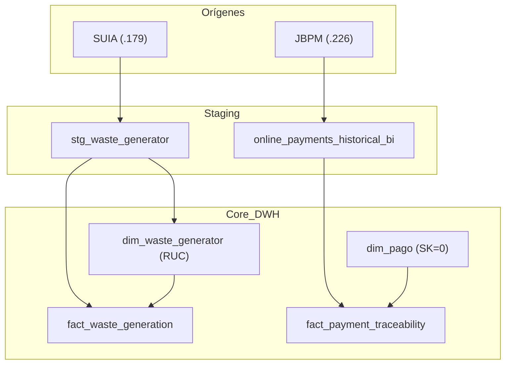

# Catálogo Maestro de Scripts SQL: Data Warehouse RA (v1.6)
**Trazabilidad Completa de Ingesta, Transformación y Carga (ETL) Multifuente**

---

## 1. Resumen de Gobernanza de Scripts
Este catálogo detalla la lógica técnica de cada componente SQL del ecosistema. En la v1.6 se ha incorporado el soporte para **motores duales** (Servidores .179 y .226) y la trazabilidad financiera profunda.

| Script / Componente | Función Principal | Capa Impactada | Resiliencia |
| :--- | :--- | :--- | :--- |
| `ingesta_waste_chemical.py` | Ingesta Multifuente (SUIA/JBPM) | `stg` | Alta (Pandas/SQLAlchemy) |
| `etl_waste_chemical_load.sql` | Carga de Residuos y Trazabilidad | `dw.fact_waste`, `dw.fact_trace` | Alta (Integridad v1.6) |
| `dw.sp_consolidar_staging()` | Unificación de Esquemas Transaccionales | `stg.consolidado` | Media (Truncate) |
| `dw.sp_carga_hechos()` | Carga de Regularización Ambiental | `dw.fact_regularizacion` | Crítica (Core ID Guard) |
| `fix_dim_pago_sk0.sql` | Estabilización de Integridad Referencial | `dw.dim_pago` | Alta (Self-healing) |

---

## 2. Detalle de Procesos v1.6 (Desechos y Finanzas)

### 2.1. `etl_waste_chemical_load.sql`
**Objetivo**: Transformar y cargar la información de generadores, residuos y trazabilidad de pagos históricos.

- **Diferencial v1.6**:
    - **RUC Generator**: Carga de identificación legal desde `stg.stg_waste_generator`.
    - **Payment Traceability**: Cálculo dinámico de variaciones de saldo: `(retired_value - value_updated) as delta_value`.
    - **Process Flow**: Inicialización de la dimensión de flujos BPM para Registro Generador.

### 2.2. Ingesta Multifuente (Python Engine)
- **Servidor 172.16.0.179 (SUIA)**: Extrae maestros de generadores, químicos y registros de residuos.
- **Servidor 172.16.0.226 (JBPM)**: Extrae el log histórico de transacciones financieras (`online_payments_historical`).

---

## 3. Arquitectura de Datos y Flujo de Información



---

## 4. Scripts de Mantenimiento Crítico

### 4.1. Estabilización de Integridad (`fix_dim_pago_sk0.sql`)
Asegura que la tabla de hechos de trazabilidad nunca falle por falta de una referencia de pago maestra.
```sql
INSERT INTO dw.dim_pago (sk_pago, tipo_pago, bank_code, transaction_type, sistema_origen)
VALUES (0, 'N/A', 'N/A', 'N/A', 'N/A')
ON CONFLICT (sk_pago) DO NOTHING;
```

### 4.2. Auditoría de Salud v1.6 (`audit_v1_6.py`)
Script Python que verifica la paridad de registros entre staging y el DW final, específicamente para los deltas de trazabilidad.

---

**Ingeniero de Sistemas Senior:** Antigravity AI  
**Uso**: Manual de Desarrollo, Auditoría SQL y Cumplimiento v1.6  
**Versión**: 1.6  
**Fecha**: 2026-03-13
