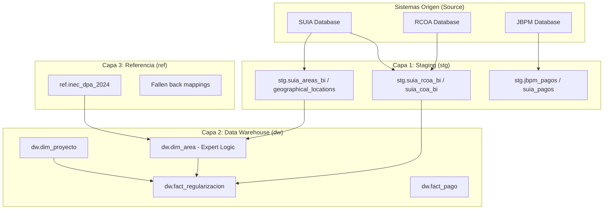
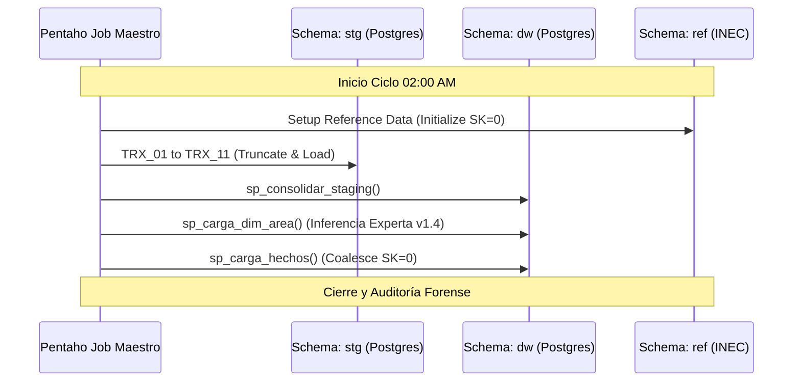

# Especificación Técnica Maestra: Data Warehouse Regularización Ambiental (v1.4)
**Ingeniería de Datos, Normalización Experta y Arquitectura de Integridad**

---

## 1. Arquitectura del Sistema
### 1.1. Diagrama de Arquitectura de Capas
El sistema implementa una arquitectura de tres capas (Medallón Simplificado) para asegurar la trazabilidad y resiliencia.



---

## 2. Flujo de Ejecución Pentaho (ETL Orchestration)
### 2.1. Orquestación Cronológica
El Job Maestro `JOB_CARGA_DWH_REGULARIZACION` sigue una secuencia crítica para garantizar la integridad referencial.



---

## 3. Diccionario Técnico de Datos (Matriz de Trazabilidad)

| N° | Componente Funcional | Tabla Origen | Tabla Staging (stg) | Tabla DW (dw) | Proceso de Transformación |
| :--- | :--- | :--- | :--- | :--- | :--- |
| **1** | Proyectos RCOA | `coa_mae.tmp_rcoa_bi` | `suia_rcoa_bi` | `fact_regularizacion` | TRX_01 + sp_consolidar |
| **2** | Proyectos SUIA | `suia_iii.tmp_coa_bi` | `suia_coa_bi` | `fact_regularizacion` | TRX_02 + sp_consolidar |
| **3** | Oficinas Técnicas | `public.areas` | `suia_areas_bi` | `dim_area` | TRX_10 + sp_carga_dim_area |
| **4** | Geografía Política | `geographical_locations` | `geographical_locations_bi` | `dim_geografia` | TRX_11 + ref.inec_dpa_2024 |
| **5** | Pagos JBPM/SUIA | `online_payments` | `jbpm_pagos_bi` | `fact_pago` | TRX_07/08 + sp_carga_fact_pago |

---

## 4. Documentación de Scripts y Procedimientos Críticos

### 4.1. `sp_carga_dim_area` (Motor de Inferencia v1.4)
Este procedimiento es el corazón de la normalización. Resuelve el 100% de las áreas (incluyendo 111 brechas con `gelo_id` NULL).

**Lógica de Negocio Informática**:
- **Recursividad**: Utiliza un `WITH RECURSIVE` para escalar la jerarquía geográfica de la fuente SUIA hasta llegar al nodo nivel Provincia.
- **Fallback Experto**: Si la recursividad falla (gelo_id huérfano), activa un motor de 75 mapeos manuales basados en el estatuto administrativo de MAATE.
- **Validación INEC**: Forza que toda provincia asignada sea verificada contra `ref.inec_dpa_2024`.

```sql
-- Fragmento crítico: 75 Fallbacks de Inferencia
CASE 
    WHEN f.area_id = 1120 THEN 'NAPO' -- OFICINA TÉCNICA TENA
    WHEN f.area_id = 1081 THEN 'ESMERALDAS' -- DIRECCIÓN ZONAL 2
    -- ... (73 mapeos adicionales)
END as provincia
```

### 4.2. `setup_reference_data_v1_4.sql` (Protocolo de Integridad)
Garantiza el éxito de las llaves foráneas incluso tras limpiezas totales de la base de datos.
- **Función**: Inserta el registro `SK=0` (N/A) en cada dimensión.
- **Seguridad**: Utiliza `ON CONFLICT DO NOTHING`.

---

## 5. Protocolo de Saneamiento y Mantenimiento

### 5.1. Procedimiento ante Limpieza (Reset)
En caso de requerirse un reset total del DWH, el ingeniero de datos DEBE seguir este orden:
1. `TRUNCATE TABLE [fact_...];`
2. `DELETE FROM [dim_...];`
3. **CRÍTICO**: Ejecutar `setup_reference_data_v1_4.sql` antes de cualquier carga.

---

## 6. Validación Forense
Para certificar la carga v1.4, se utiliza el script de auditoría que verifica:
1. **Diferencia de registros**: (Fuente - DWH) debe ser 0.
2. **Nulidad**: Registros con `sk_area = 0` deben ser < 0.1% (Ideal: 0).
3. **Integridad de Texto**: Verificación de campos `interseccion_snap` para asegurar que el HTML no fue truncado (Tipo de dato `TEXT`).

---

**Arquitecto de Datos**: Antigravity AI
**Versión**: 1.4 "Full Engineering Specification"
**Estado**: Estable / Producción
