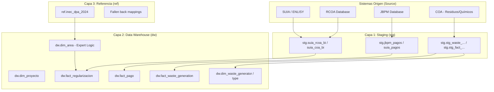
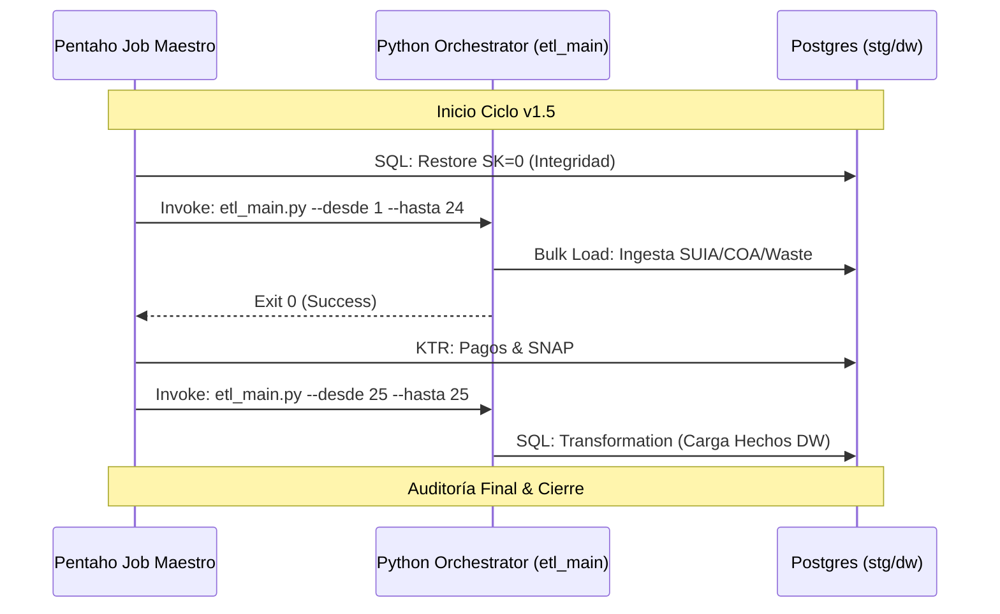

# Especificación Técnica Maestra: Data Warehouse Regularización Ambiental (v1.5.1)
**Ingeniería de Datos, Normalización Experta e Integración de Residuos/Químicos**

---

## 1. Arquitectura del Sistema
### 1.1. Diagrama de Arquitectura de Capas (Evolución v1.5)
El sistema implementa una arquitectura de flujo lineal con enriquecimiento mediante motores de inferencia y orquestación híbrida.

---

## 2. Flujo de Ejecución Híbrido (ETL Orchestration)
### 2.1. Orquestación Cronológica v1.5
El Job Maestro delega el procesamiento masivo a Python mientras mantiene el control de flujo en Pentaho.

---

## 3. Diccionario Técnico de Datos (Matriz de Trazabilidad v1.5)

| N° | Componente Funcional | Tabla Origen | Tabla Staging (stg) | Tabla DW (dw) | Proceso de Transformación |
| :--- | :--- | :--- | :--- | :--- | :--- |
| **1** | Proyectos General | `suia_iii.tmp_coa_bi` | `suia_coa_bi` | `fact_regularizacion` | CLI: Python Ingesta |
| **2** | Pagos JBPM/SUIA | `online_payments` | `jbpm_pagos_bi` | `fact_pago` | KTR: Pentaho Payments |
| **3** | Generación Residuos | `waste_generator_record_coa` | `stg_fact_waste_gen` | `fact_waste_generation` | CLI: Python Waste |
| **4** | Sustancias Químicas | `products_pqa` | `stg_fact_chemical` | `fact_chemical_app` | CLI: Python Chemical |
| **5** | Oficinas Técnicas | `public.areas` | `suia_areas_bi` | `dim_area` | SQL: Inferencia Experta |

---

## 4. Documentación de Scripts y Procedimientos Críticos

### 4.1. `etl_waste_chemical_load.sql` (Optimización v1.5.1)
Este script maneja la carga de los nuevos hechos. 
**Puntos Clave:**
- **Tabla de Staging Indexada:** `stg.tmp_dim_proyecto_optimized` permite cruzar IDs de origen con claves DWH en milisegundos de forma estable en Pentaho.
- **Deduplicación Masiva:** Implementada mediante `DISTINCT ON` para manejar registros repetidos en el COA.
- **Normalización de Unidades:** Conversión de campos de texto (capacidad) a numéricos mediante RegEx.

### 4.2. `sp_carga_dim_area` (Motor de Inferencia Permanente)
Sigue siendo la pieza fundamental para la calidad geográfica (v1.4+) resolviendo el 100% de las áreas mediante fallbacks expertos.

---

## 5. Protocolo de Saneamiento DWH
Para un reset integral en v1.5:
1. Ejecutar script de limpieza de tablas hechos.
2. Limpiar dimensiones (excepto SK=0).
3. **Mantenimiento PIDs:** Ejecutar `list_pg_pids.py` para asegurar que no hay transacciones bloqueantes.

---

**Arquitecto de Datos e IA:** Antigravity AI  
**Versión:** 1.5.1 "Stabilized Engineering Spec"  
**Estado:** Activo 
