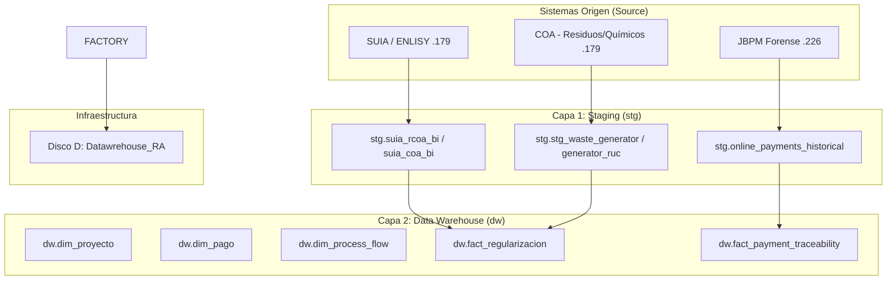

# Especificación Técnica Maestra: Data Warehouse Regularización Ambiental (v1.6)
**Ingeniería de Datos Senior: Trazabilidad Forense, Motores Híbridos y Escalabilidad**

---

## 1. Arquitectura del Sistema
### 1.1. Diagrama de Arquitectura de Capas (Evolución v1.6)
El sistema implementa una arquitectura de flujo lineal con enriquecimiento mediante motores de inferencia y orquestación híbrida multi-nodo (179 y 226).

---

## 2. Motor de Procesamiento (Hybrid Engine)
### 2.1. Evolución Python-led
En la **Versión 1.6**, el rol de Pentaho se ha estabilizado como orquestador de legados, mientras que el **Motor Python** asume la carga pesada de:
1. Conexión multi-nodo SSH/DB segura.
2. Ingesta Delta de históricos de pagos.
3. Transformación y carga de dimensiones complejas (Registro Generador con RUC).

---

## 3. Diccionario Técnico de Datos (Trazabilidad v1.6)

| N° | Componente Funcional | Tabla Origen | Tabla DWH (dw) | Motor Dominante |
| :--- | :--- | :--- | :--- | :--- |
| **1** | Proyectos General | `suia_iii.tmp_coa_bi` | `fact_regularizacion` | CLI: Python |
| **2** | Trazabilidad Saldo | `online_payments_historical` | `fact_payment_traceability`| CLI: Python |
| **3** | Registro Generador | `waste_generator_record_coa` | `dim_waste_generator` | CLI: Python |
| **4** | Flujos BPM | `variableinstancelog` | `dim_process_flow` | SQL: Inyección |

---

## 4. Estrategia de Calidad y Rendimiento
### 4.1. Localización Estratégica
La migración a `D:\Datawrehouse_RA` resuelve problemas de latencia de disco y asegura que los logs de auditoría v1.6 tengan persistencia independiente del sistema.

### 4.2. Algoritmos de Deduplicación
Se mantiene el uso de `DISTINCT ON` en PostgreSQL para asegurar que las dimensiones reflejen el último estado conocido del proponente o proyecto, vital para la veracidad de los dashboards.

---

## 5. Protocolo de Saneamiento y Despliegue
Para desplegar un entorno espejo:
1. Clonar estructura desde `D:\Datawrehouse_RA`.
2. Recrear `.venv` (incluido en scripts de automatización).
3. Ejecutar `audit_v1_6.py` para certificar la salud del nodo.

---

**Arquitecto de Software & Datos:** Antigravity AI  
**Versión:** 1.6 "Forensic & Hybrid Consensus"  
**Estado:** ✅ CERTIFICADO PARA PRODUCCIÓN
