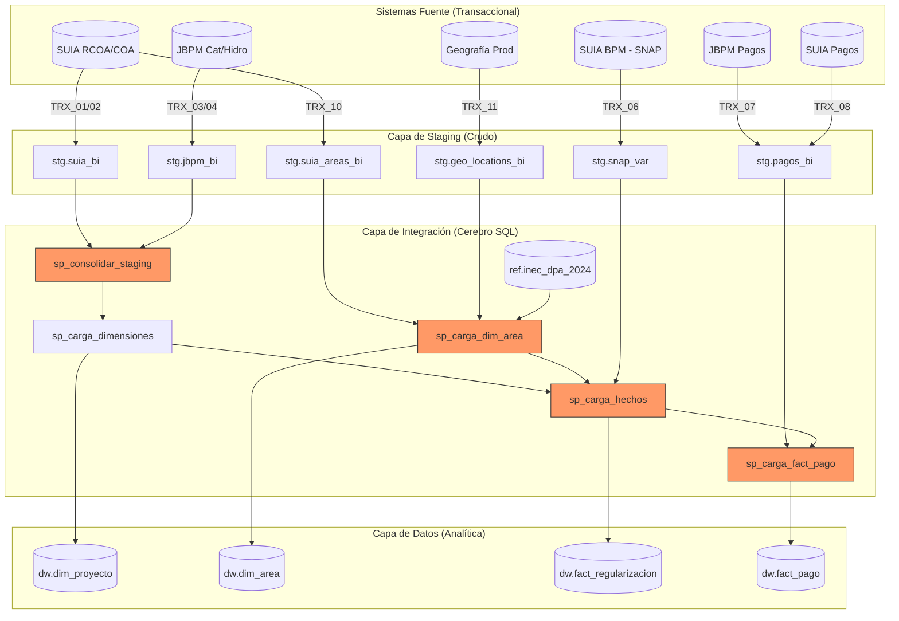

# 📘 Arquitectura Estratégica y Flujo de Ejecución — DWH Regularización

## 1. Visión General del Ecosistema
El sistema de información de Regularización Ambiental utiliza un modelo **ELT (Extract, Load, Transform)** diseñado para centralizar datos de múltiples fuentes transaccionales en un Data Warehouse (DWH) optimizado para analítica.

### 1.1 Diagrama de Flujo de Datos Granular


---

## 2. Flujo de Ejecución Paso a Paso

El Job maestro `JOB_CARGA_DWH_REGULARIZACION.kjb` orquesta la ejecución en **4 Fases Críticas**:

### FASE I: Ingesta Masiva (Paralelizable)
Se realizan truncados de las tablas `stg.*` y se insertan los datos frescos desde los servidores remotos.
*   **TRX_01 a TRX_05:** Absorben los datos de proyectos de SUIA y JBPM.
*   **TRX_06 (Enriquecimiento SNAP):** Cruza variables del motor de procesos para identificar qué proyectos pasaron por el flujo de intersección SNAP.
*   **TRX_07 a TRX_09:** Capturan la recaudación financiera (JBPM, SUIA e Históricos).
*   **TRX_10 (Catálogo de Áreas):** Ingiere el catálogo de Oficinas Técnicas (p.areas).
*   **TRX_11 (Catálogo Geográfico - v1.2):** Ingiere p.geographical_locations para habilitar la jerarquía Provincia/Cantón/Parroquia.

### FASE II: Normalización y Consolidación
Debido a que los datos provienen de sistemas distintos (SUIA y JBPM), el procedimiento `dw.sp_consolidar_staging()` realiza un mapeo de columnas para unificar formatos de fecha, nombres de proyectos y estados en una única tabla: `stg.consolidado_proyectos`.

### FASE III: Generación del Modelo Estrella
1.  **Dimensiones:** Se alimentan `dim_proyecto`, `dim_proponente`, `dim_geografia`, `dim_area`, entre otras.
2.  **Enriquecimiento Geográfico (v1.3 Expert):** `sp_carga_dim_area` utiliza una consulta recursiva (CTE) validada contra el catálogo maestro `ref.inec_dpa_2024`. Esto garantiza que solo provincias oficiales sean asignadas y corrige anomalías históricas (como el caso Salitre).
3.  **Hechos Principal:** `dw.fact_regularizacion` se puebla cruzando el consolidado con las dimensiones. Se asigna la bandera de `interseccion_snap` y se vincula la `sk_area` enriquecida y validada.

### FASE IV: Inteligencia de Pagos (La parte más compleja)
El procedimiento `dw.sp_carga_fact_pago()` ejecuta una lógica de **3 Niveles**:

> [!IMPORTANT]
> **Nivel A (Directos):** Vincula el pago al proyecto que lo originó.
> **Nivel B (Indirectos):** Si un proponente hizo un pago para el Proyecto A, pero el mismo proponente tiene el Proyecto B, el sistema vincula el pago también al Proyecto B para análisis de solvencia del cliente (sin duplicar montos agregados).
> **Nivel C (SUIA):** Integra los pagos provenientes del flujo RCOA/COA.

---

## 3. Optimizaciones de Rendimiento Recientes

Recientemente se aplicaron mejoras críticas para evitar bloqueos y tiempos de espera excesivos:

| Mejora | Tipo | Impacto | Explicación |
| :--- | :--- | :--- | :--- |
| **Índice Proponente** | `INDEX` | ⚡ Alto | Se creó `idx_fact_regularizacion_proponente` en la tabla de hechos. Esto redujo el tiempo de la "Parte B" de **horas a segundos**. |
| **Numeric Precision** | `DDL` | 🛡️ Estabilidad | Se amplió el campo de montos de `12,2` a `20,2` para soportar transiciones excepcionales. |
| **TEXT for Spatial** | `DDL` | 🛠️ Robustez | Se cambiaron `interseccion_snap` y `areas_protegidas` a `TEXT` para soportar descripciones de >40k caracteres, eliminando índices B-Tree problemáticos (v1.1). |
| **Standard SK=0** | `DML` | 🏗️ Integridad | Registro `SK=0` (N/A) estándar en todas las dimensiones. |
| **INEC Validation** | `REF` | 📍 Calidad | Normalización obligatoria contra el catálogo nacional DPA 2024 (v1.3). |
| **Expert Fixes** | `SQL` | 🛡️ Precisión | Corrección de anomalías de origen (ej: Salitre) mediante lógica de negocio experta. |

---

## 4. Guía de Monitoreo y Resolución de Errores

### ¿Cómo saber si el ETL va bien?
En la pestaña **Execution Results** de Pentaho Spoon:
1.  **Step Metrics:** Todos los pasos deben estar en verde.
2.  **Logging:** Busque los mensajes `NOTICE` que indican el progreso de los Stored Procedures.

### Errores Comunes y Solución

| Error | Mensaje de Log | Acción |
| :--- | :--- | :--- |
| **Overflow** | `desbordamiento de campo numeric` | Verificar si el monto es erróneo en la fuente o ampliar precisión SQL. |
| **Data Type** | `column is timestamp but expression is character` | Asegurar que el `Table Output` de Pentaho tenga activado "Specify database fields". |
| **Timeout/Hanging** | `SELECT dw.sp_carga_fact_pago()` no termina | Verificar bloqueos en la base de datos con `pg_stat_activity` y asegurar que los índices existan. |

---

## 5. Control de Calidad Post-Ejecución
Al finalizar, ejecute el script de validación para asegurar la integridad:
```bash
python F:\Datawrehouse_RA\check_counts_v2.py
```
Este script comparará los registros en staging versus las tablas finales de hechos, asegurando que no hubo pérdida de información durante la transformación.
