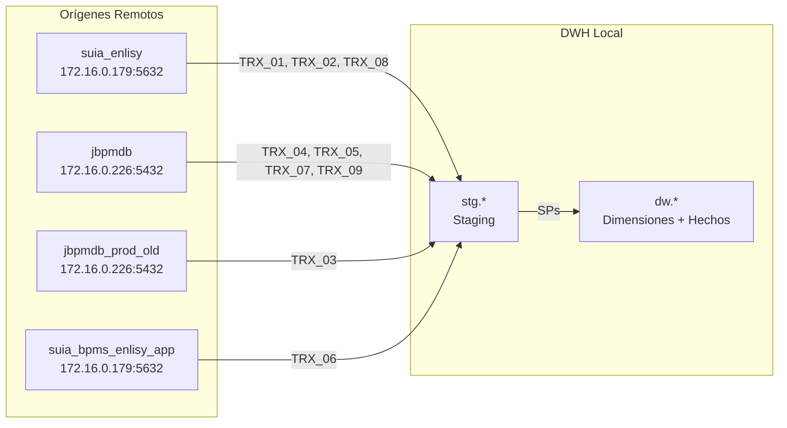
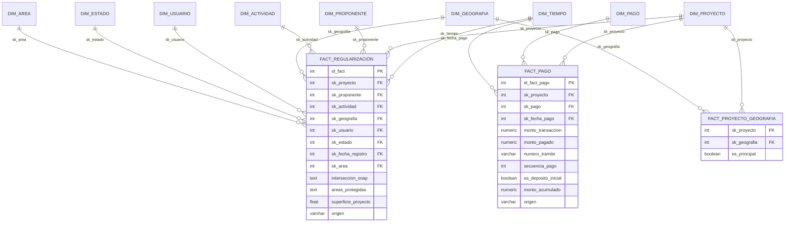

# Documentación Técnica — ETL Data Warehouse Regularización Ambiental

**Proyecto:** Data Warehouse DWH Regularización Ambiental (`dw_reg_v1`)
**Plataforma ETL:** Pentaho Data Integration (PDI) 11.0
**Versión documento:** 1.0 — 2026-03-05
**Autor:** Arquitectura de Datos — DWH Team

---

## 1. Arquitectura General



El proceso ETL se ejecuta diariamente a las 02:00 AM y sigue el patrón **ELT** (Extract-Load-Transform):

1. **Extracción + Carga (E+L):** 11 Transformaciones Pentaho extraen datos de 4 bases remotas y los cargan en tablas **staging** (`stg.*`)
2. **Transformación (T):** 9 pasos SQL/Stored Procedures consolidan, transforman y cargan las tablas dimensionales y de hechos (`dw.*`)

---

## 2. Conexiones de Base de Datos

| Nombre Conexión | Servidor | Puerto | Base de Datos | Rol |
|-----------------|----------|--------|---------------|-----|
| `CONN_SUIA_ENLISY` | 172.16.0.179 | 5632 | `suia_enlisy` | Origen RCOA, COA y Pagos SUIA |
| `CONN_SUIA_BPMS` | 172.16.0.179 | 5632 | `suia_bpms_enlisy_app` | Origen variables SNAP |
| `CONN_JBPM` | 172.16.0.226 | 5432 | `jbpmdb` | Origen 4 Categorías, Hidro, Pagos JBPM, Históricos |
| `CONN_JBPM_OLD` | 172.16.0.226 | 5432 | `jbpmdb_prod_old` | Origen Sector/Subsector |
| `CONN_DWH_LOCAL` | localhost | 5432 | `dw_reg_v1` | Destino DWH (staging + dimensiones + hechos) |

> [!NOTE]
> Todas las conexiones usan motor PostgreSQL con usuario `postgres`. La conexión destino usa la variable de Pentaho `CONN_DWH_LOCAL`.

---

## 3. Job Maestro — Flujo de Ejecución

**Archivo:** [JOB_CARGA_DWH_REGULARIZACION.kjb](file:///f:/Datawrehouse_RA/Jobs/JOB_CARGA_DWH_REGULARIZACION.kjb)

```mermaid
graph TD
    START(["▶ START"]) --> TRX01["TRX_01<br>Ingesta SUIA RCOA"]
    TRX01 --> TRX02["TRX_02<br>Ingesta SUIA COA"]
    TRX02 --> TRX03["TRX_03<br>Ingesta JBPM Sector"]
    TRX03 --> TRX04["TRX_04<br>Ingesta JBPM 4Cat"]
    TRX04 -.->|deshabilitado| TRX05["TRX_05<br>Ingesta JBPM Hidro"]
    TRX05 --> TRX06["TRX_06<br>Ingesta SNAP"]
    TRX06 --> TRX07["TRX_07<br>Ingesta Pagos JBPM"]
    TRX07 --> TRX08["TRX_08<br>Ingesta Pagos SUIA"]
    TRX08 --> TRX10["TRX_10<br>Ingesta Areas SUIA"]
    TRX10 --> TRX11["TRX_11<br>Ingesta Geografía"]
    TRX11 --> SP1["SP Consolidar<br>Staging"]
    SP1 --> SP2["SP Cargar<br>Dimensiones"]
    SP2 --> SP10["SP Cargar<br>Dim Area (v1.3)"]
    SP10 --> SP3["SP Cargar<br>Fact Table"]
    SP3 --> SP4["SP Cargar<br>Dim Pago"]
    SP4 --> SP5["SP Cargar<br>Fact Pago"]
    SP5 --> SP6["Update Area<br>Responsable"]
    SP6 --> SP7["SP Bridge<br>Proyecto-Geografía"]
    SP7 --> TRX09["TRX_09<br>Ingesta Pagos Hist"]
    TRX09 --> SP8["Recálculo<br>Montos JBPM"]
    SP8 --> SP9["SP Secuencia<br>Pagos"]
    SP9 --> FIN(["✓ Éxito"])

    style START fill:#4CAF50,color:#fff
    style FIN fill:#4CAF50,color:#fff
    style TRX05 fill:#FF9800,color:#fff
    style TRX10 fill:#f96,color:#333
    style TRX11 fill:#f96,color:#333
    style SP10 fill:#f96,color:#333
```



> [!WARNING]
> El hop TRX_04 → TRX_05 (Hidrocarburos) está **deshabilitado** en la configuración actual.

---

## 4. Fase 1 — Transformaciones de Ingesta

Todas las transformaciones siguen el patrón: `TableInput (remoto)` → `TableOutput (stg.*)` con TRUNCATE previo.

### 4.1 TRX_01 — Ingesta SUIA RCOA

| Campo | Valor |
|-------|-------|
| **Archivo** | [TRX_01_INGESTA_SUIA_RCOA.ktr](file:///f:/Datawrehouse_RA/transformations/TRX_01_INGESTA_SUIA_RCOA.ktr) |
| **Conexión origen** | `CONN_SUIA_ENLISY` → `suia_enlisy` |
| **Tabla origen** | `coa_mae.tmp_rcoa_bi` |
| **Tabla destino** | `stg.suia_rcoa_bi` |
| **Columnas** | 36 (codigo_proyecto, nombre_proyecto, ..., superficie_proyecto, fecha_carga) |
| **Estrategia** | TRUNCATE + INSERT completo |

### 4.2 TRX_02 — Ingesta SUIA COA

| Campo | Valor |
|-------|-------|
| **Archivo** | [TRX_02_INGESTA_SUIA_COA.ktr](file:///f:/Datawrehouse_RA/transformations/TRX_02_INGESTA_SUIA_COA.ktr) |
| **Conexión origen** | `CONN_SUIA_ENLISY` → `suia_enlisy` |
| **Tabla origen** | `suia_iii.tmp_coa_bi` |
| **Tabla destino** | `stg.suia_coa_bi` |
| **Columnas** | 36 (misma estructura que TRX_01) |

### 4.3 TRX_03 — Ingesta JBPM Sector

| Campo | Valor |
|-------|-------|
| **Archivo** | [TRX_03_INGESTA_JBPM_SECTOR.ktr](file:///f:/Datawrehouse_RA/transformations/TRX_03_INGESTA_JBPM_SECTOR.ktr) |
| **Conexión origen** | `CONN_JBPM_OLD` → `jbpmdb_prod_old` |
| **Tabla origen** | `public.vm_sector_subsector_bi` |
| **Tabla destino** | `stg.jbpm_sector_bi` |
| **Columnas** | 32 (incluye `ente_acreditado`, `estrategico`, no incluye `superficie_proyecto`) |

### 4.4 TRX_04 — Ingesta JBPM 4 Categorías

| Campo | Valor |
|-------|-------|
| **Archivo** | [TRX_04_INGESTA_JBPM_4CAT.ktr](file:///f:/Datawrehouse_RA/transformations/TRX_04_INGESTA_JBPM_4CAT.ktr) |
| **Conexión origen** | `CONN_JBPM` → `jbpmdb` |
| **Tabla origen** | `public.vm_cuatro_categorias_bi` |
| **Tabla destino** | `stg.jbpm_4cat_bi` |
| **Columnas** | 32 (misma estructura que TRX_03) |

### 4.5 TRX_05 — Ingesta JBPM Hidrocarburos ⚠️

| Campo | Valor |
|-------|-------|
| **Archivo** | [TRX_05_INGESTA_JBPM_HIDRO.ktr](file:///f:/Datawrehouse_RA/transformations/TRX_05_INGESTA_JBPM_HIDRO.ktr) |
| **Conexión origen** | `CONN_JBPM` → `jbpmdb` |
| **Tabla origen** | `public.vwt_hidrocarbonos_bi` |
| **Tabla destino** | `stg.jbpm_hidro_bi` |
| **Estado** | **Hop deshabilitado** — no se ejecuta actualmente |

### 4.6 TRX_06 — Ingesta SNAP

| Campo | Valor |
|-------|-------|
| **Archivo** | [TRX_06_INGESTA_SNAP.ktr](file:///f:/Datawrehouse_RA/transformations/TRX_06_INGESTA_SNAP.ktr) |
| **Conexión origen** | `CONN_SUIA_BPMS` → `suia_bpms_enlisy_app` |
| **Tablas origen** | `variableinstancelog` JOIN `processinstancelog` |
| **Tabla destino** | `stg.jbpm_snap_variables` |
| **Columnas** | 6 (codigo_proyecto, processinstanceid, nombre_proceso, estado_proceso, fecha_inicio_proceso, fecha_fin_proceso) |
| **Filtros** | `variableid IN ('tramite', 'numero_tramite')`, `status IN (1, 2)`, EXISTS variable SNAP |

### 4.7 TRX_07 — Ingesta Pagos JBPM

| Campo | Valor |
|-------|-------|
| **Archivo** | [TRX_07_INGESTA_PAGOS_JBPM.ktr](file:///f:/Datawrehouse_RA/transformations/TRX_07_INGESTA_PAGOS_JBPM.ktr) |
| **Conexión origen** | `CONN_JBPM` → `jbpmdb` |
| **Tablas origen** | `online_payment.online_payments_historical` JOIN `online_payment.online_payments` |
| **Tabla destino** | `stg.online_payments_bi` |
| **Columnas** | 9 (online_payment_id, project_id, tramit_number, ..., transaction_state) |
| **Filtro** | `transaction_state = true` |

### 4.8 TRX_08 — Ingesta Pagos SUIA

| Campo | Valor |
|-------|-------|
| **Archivo** | [TRX_08_INGESTA_PAGOS_SUIA.ktr](file:///f:/Datawrehouse_RA/transformations/TRX_08_INGESTA_PAGOS_SUIA.ktr) |
| **Conexión origen** | `CONN_SUIA_ENLISY` → `suia_enlisy` |
| **Tablas origen** | `suia_iii.financial_transaction` JOIN `coa_mae.project_licencing_coa` JOIN `suia_iii.financial_transaction_log` |
| **Tabla destino** | `stg.financial_transaction_bi` |
| **Columnas** | 11 (fitr_id, codigo_proyecto, montos, payment_type_desc, task_name, processname, ...) |
| **Filtro** | `fitr_status = true` |

### 4.9 TRX_09 — Ingesta Pagos Históricos JBPM (v3)

| Campo | Valor |
|-------|-------|
| **Archivo** | [TRX_09_INGESTA_PAGOS_HIST.ktr](file:///f:/Datawrehouse_RA/transformations/TRX_09_INGESTA_PAGOS_HIST.ktr) |
| **Conexión origen** | `CONN_JBPM` → `jbpmdb` |
| **Tabla origen** | `online_payment.online_payments_historical` |
| **Tabla destino** | `stg.online_payments_historical_bi` |
| **Columnas** | 17 (id_online_payment_historical, description, project_id, retired_value, value_updated, ...) |
| **Propósito** | Alimenta el recálculo de montos transaccionales basado en saldos remanentes |

### 4.10 TRX_10 — Ingesta Areas SUIA (v1.1)

| Campo | Valor |
|-------|-------|
| **Archivo** | [TRX_10_INGESTA_AREAS_SUIA.ktr](file:///f:/Datawrehouse_RA/transformations/TRX_10_INGESTA_AREAS_SUIA.ktr) |
| **Conexión origen** | `CONN_SUIA_ENLISY` → `suia_enlisy` |
| **Tabla origen** | `public.areas` |
| **Tabla destino** | `stg.suia_areas_bi` |
| **Columnas** | 9 (area_id, area_name, zone_id, gelo_id, etc.) |
| **Propósito** | Catalogo de Oficinas Técnicas vinculado a geografía |

### 4.11 TRX_11 — Ingesta Geografía (v1.2)

| Campo | Valor |
|-------|-------|
| **Archivo** | [TRX_11_INGESTA_GEOGRAFIA.ktr](file:///f:/Datawrehouse_RA/transformations/TRX_11_INGESTA_GEOGRAFIA.ktr) |
| **Conexión origen** | `CONN_SUIA_ENLISY` → `suia_enlisy` |
| **Tabla origen** | `public.geographical_locations` |
| **Tabla destino** | `stg.geographical_locations_bi` |
| **Columnas** | 4 (gelo_id, gelo_name, gelo_parent_id, gelo_codification_inec) |
| **Propósito** | Catalogo de jerarquía (Provincia, Cantón, Parroquia) |

---

## 5. Fase 2 — Stored Procedures y Transformaciones SQL

### 5.1 SP Consolidar Staging — `dw.sp_consolidar_staging()`

**Propósito:** Unifica las 5 tablas staging en `stg.consolidado_proyectos` mediante UNION ALL.

**Flujo:**
```
stg.suia_rcoa_bi  ──┐
stg.suia_coa_bi   ──┤
stg.jbpm_sector_bi ─┼──► TRUNCATE + INSERT ──► stg.consolidado_proyectos
stg.jbpm_4cat_bi  ──┤
stg.jbpm_hidro_bi ──┘
```

**Normalización:** Cada origen tiene columnas ligeramente diferentes; el SP normaliza a un esquema uniforme de 39 columnas incluyendo `origen` como discriminador.

---

### 5.2 SP Cargar Dimensiones — `dw.sp_carga_dimensiones()`

**Propósito:** Puebla las 7 tablas dimensionales del modelo estrella.

| Dimensión | Tabla | Clave Natural | Estrategia |
|-----------|-------|---------------|------------|
| Tiempo | `dw.dim_tiempo` | `fecha` (UNIQUE) | INSERT ON CONFLICT DO NOTHING — rango 2005-2030 |
| Proyecto | `dw.dim_proyecto` | `codigo_proyecto` (UNIQUE) | DISTINCT ON + ON CONFLICT DO UPDATE |
| Proponente | `dw.dim_proponente` | `ced_ruc_proponente` (UNIQUE) | ON CONFLICT DO UPDATE |
| Actividad | `dw.dim_actividad` | `codigo_actividad` (UNIQUE) | ON CONFLICT DO NOTHING |
| Geografía | `dw.dim_geografia` | `(provincia, canton, parroquia)` (UNIQUE) | ON CONFLICT DO NOTHING |
| Usuario | `dw.dim_usuario` | `usuario_tarea` (UNIQUE) | ON CONFLICT DO NOTHING |
| Estado | `dw.dim_estado` | `(estado_proceso, estado_proyecto, estado_tramite)` | ON CONFLICT DO NOTHING |
| Area | `dw.dim_area` | `id_area` (UNIQUE) | **Expert v1.3** — Validado contra `ref.inec_dpa_2024` |

---

### 5.3 SP Cargar Fact Table — `dw.sp_carga_hechos()`

**Propósito:** Puebla `dw.fact_regularizacion` con la intersección SNAP.

**Lógica clave:**
- JOIN con todas las dimensiones vía claves naturales
- LEFT JOIN con `dw.dim_area` vía el `id_area` del consolidado
- LEFT JOIN con `stg.jbpm_snap_variables` para determinar `interseccion_snap` (SI/NO)
- Incluye fechas de proceso/tarea, número de resolución, áreas protegidas

---

### 5.4 SP Cargar Dim Pago — `dw.sp_carga_dim_pago()`

**Propósito:** Puebla `dw.dim_pago` con tipos de pago únicos desde ambas fuentes.

**Fuentes:**
- JBPM: `stg.online_payments_bi` → `(tipo_pago='Online Payment', bank_code, transaction_type, sistema_origen='JBPM')`
- SUIA: `stg.financial_transaction_bi` → `(tipo_pago=payment_type_desc, bank_code='N/A', transaction_type=processname, sistema_origen='SUIA_RCOA')`

---

### 5.5 SP Cargar Fact Pago — `dw.sp_carga_fact_pago()`

**Propósito:** Puebla `dw.fact_pago` con deduplicación mediante ON CONFLICT.

**Tres partes:**
- **Parte A** — Pagos JBPM directos por `project_id`
- **Parte B** — Pagos JBPM indirectos: misma transacción asociada a otros proyectos del mismo proponente
- **Parte C** — Pagos SUIA (`financial_transaction`)

---

### 5.6 Update Area Responsable (v2)

**Propósito:** Actualiza `dw.dim_proyecto.area_responsable` desde `stg.consolidado_proyectos`.

```sql
UPDATE dw.dim_proyecto dp
SET area_responsable = sub.area_responsable_proyecto
FROM (SELECT DISTINCT ON (codigo_proyecto) ...) sub
WHERE dp.area_responsable IS NULL OR dp.area_responsable = '';
```

---

### 5.7 SP Bridge Proyecto-Geografía — `dw.sp_carga_proyecto_geografia()` (v2)

**Propósito:** Pobla la bridge table `dw.fact_proyecto_geografia` que resuelve la relación M:N entre proyectos y ubicaciones geográficas.

- TRUNCATE + INSERT de todas las combinaciones únicas (sk_proyecto, sk_geografia)
- Marca la primera ubicación (por tarea más reciente) como `es_principal = true`

---

### 5.8 Recálculo Montos JBPM (v3)

**Propósito:** Corrige `monto_transaccion` en `dw.fact_pago` usando el historial de saldos de `online_payments_historical`.

**Algoritmo:**
1. Ordena registros históricos por `id_online_payment_historical`
2. Calcula `saldo_anterior` usando `LAG()` sobre `value_updated`
3. El monto real = `saldo_anterior - saldo_actual`
4. UPDATE sobre `fact_pago` donde `origen = 'JBPM'`

---

### 5.9 SP Calcular Secuencia Pagos — `dw.sp_calcular_secuencia_pagos()` (v2/v3)

**Propósito:** Calcula el orden y acumulado de pagos por `tramit_number`.

**Campos actualizados en `fact_pago`:**

| Campo | Descripción |
|-------|-------------|
| `secuencia_pago` | `ROW_NUMBER()` dentro de cada `tramit_number` |
| `es_deposito_inicial` | `true` si `secuencia_pago = 1` |
| `monto_acumulado` | `SUM()` acumulativa de `monto_transaccion` |

---

## 6. Modelo de Datos (Esquema Estrella)



---

## 7. Estructura de Archivos

```
F:\Datawrehouse_RA\
├── Jobs\
│   ├── JOB_CARGA_DWH_REGULARIZACION.kjb   ← Job Maestro (18 pasos + Éxito)
│   ├── Orquestador .kjb                    ← Obsoleto (no usar)
│   ├── job_diario_dwh.bat                  ← Script BAT alternativo
│   └── log\
├── transformations\
│   ├── TRX_01_INGESTA_SUIA_RCOA.ktr
│   ├── TRX_02_INGESTA_SUIA_COA.ktr
│   ├── TRX_03_INGESTA_JBPM_SECTOR.ktr
│   ├── TRX_04_INGESTA_JBPM_4CAT.ktr
│   ├── TRX_05_INGESTA_JBPM_HIDRO.ktr
│   ├── TRX_06_INGESTA_SNAP.ktr
│   ├── TRX_07_INGESTA_PAGOS_JBPM.ktr
│   ├── TRX_08_INGESTA_PAGOS_SUIA.ktr
│   ├── TRX_09_INGESTA_PAGOS_HIST.ktr
│   ├── TRX_10_INGESTA_AREAS_SUIA.ktr
│   └── TRX_11_INGESTA_GEOGRAFIA.ktr
├── ddl_dwh_completo.sql                    ← DDL + SPs base (v1)
├── ddl_modulo_pagos.sql                    ← DDL módulo de pagos
├── etl_carga_datos.sql                     ← ETL v1 (equivalente SQL del Job)
├── v2\
│   ├── ddl_dwh_v2.sql                      ← DDL v2 (bridge, secuencia)
│   └── etl_carga_datos_v2.sql              ← ETL v2 (SPs nuevos)
├── v3\
│   ├── ddl_dwh_v3.sql                      ← DDL v3 (tabla históricos)
│   └── etl_carga_datos_v3.sql              ← ETL v3 (recálculo montos)
└── log\                                    ← Logs por transformación
```

---

## 8. Ejecución

### 8.1 Ejecución desde Pentaho Spoon (GUI)

```
1. Abrir:  C:\pentaho\pdi-ce-11.0.0.0-237\data-integration\Spoon.bat
2. Menú:   File → Open → F:\Datawrehouse_RA\Jobs\JOB_CARGA_DWH_REGULARIZACION.kjb
3. Clic:   ▶ Run (botón verde) → Launch
4. Logs:   Panel inferior muestra progreso paso a paso
```

### 8.2 Ejecución desde línea de comandos (Kitchen)

```bat
C:\pentaho\pdi-ce-11.0.0.0-237\data-integration\Kitchen.bat ^
  /file:"F:\Datawrehouse_RA\Jobs\JOB_CARGA_DWH_REGULARIZACION.kjb" ^
  /level:Basic ^
  /logfile:"F:\Datawrehouse_RA\log\job_execution.log"
```

### 8.3 Ejecución alternativa (BAT + psql)

```bat
F:\Datawrehouse_RA\Jobs\job_diario_dwh.bat
```

> [!IMPORTANT]
> El BAT ejecuta los scripts SQL directamente con `psql` y no usa Pentaho. Produce los mismos resultados pero requiere acceso directo a las bases remotas vía `dblink` en vez de conexiones Pentaho.

---

## 9. Logs y Monitoreo

Cada transformación genera un archivo de log en `F:\Datawrehouse_RA\log\`:

| Archivo | Transformación |
|---------|----------------|
| `TRX_01.log` | Ingesta SUIA RCOA |
| `TRX_02.log` | Ingesta SUIA COA |
| `TRX_03.log` | Ingesta JBPM Sector |
| `TRX_04.log` | Ingesta JBPM 4Cat |
| `TRX_05.log` | Ingesta JBPM Hidro |
| `TRX_06.log` | Ingesta SNAP |
| `TRX_07.log` | Ingesta Pagos JBPM |
| `TRX_08.log` | Ingesta Pagos SUIA |
| `TRX_09.log` | Ingesta Pagos Históricos |
| `TRX_10.log` | Ingesta Areas SUIA |
| `TRX_11.log` | Ingesta Geografía (v1.2) |

---

## 10. Consultas de Verificación Post-Ejecución

```sql
-- Conteo staging
SELECT 'suia_rcoa_bi' t, COUNT(1) n FROM stg.suia_rcoa_bi
UNION ALL SELECT 'suia_coa_bi', COUNT(1) FROM stg.suia_coa_bi
UNION ALL SELECT 'jbpm_sector_bi', COUNT(1) FROM stg.jbpm_sector_bi
UNION ALL SELECT 'jbpm_4cat_bi', COUNT(1) FROM stg.jbpm_4cat_bi
UNION ALL SELECT 'jbpm_hidro_bi', COUNT(1) FROM stg.jbpm_hidro_bi
UNION ALL SELECT 'jbpm_snap_variables', COUNT(1) FROM stg.jbpm_snap_variables
UNION ALL SELECT 'suia_areas_bi', COUNT(1) FROM stg.suia_areas_bi
UNION ALL SELECT 'geographical_locations_bi', COUNT(1) FROM stg.geographical_locations_bi
UNION ALL SELECT 'consolidado', COUNT(1) FROM stg.consolidado_proyectos;

-- Conteo dimensiones
SELECT 'dim_proyecto' t, COUNT(1) n FROM dw.dim_proyecto
UNION ALL SELECT 'dim_proponente', COUNT(1) FROM dw.dim_proponente
UNION ALL SELECT 'dim_actividad', COUNT(1) FROM dw.dim_actividad
UNION ALL SELECT 'dim_geografia', COUNT(1) FROM dw.dim_geografia
UNION ALL SELECT 'dim_usuario', COUNT(1) FROM dw.dim_usuario
UNION ALL SELECT 'dim_estado', COUNT(1) FROM dw.dim_estado
UNION ALL SELECT 'dim_area', COUNT(1) FROM dw.dim_area
UNION ALL SELECT 'inec_dpa_2024 (ref)', COUNT(1) FROM ref.inec_dpa_2024
UNION ALL SELECT 'dim_pago', COUNT(1) FROM dw.dim_pago;

-- Conteo hechos
SELECT 'fact_regularizacion' t, COUNT(1) n FROM dw.fact_regularizacion
UNION ALL SELECT 'fact_pago', COUNT(1) FROM dw.fact_pago
UNION ALL SELECT 'fact_proyecto_geografia', COUNT(1) FROM dw.fact_proyecto_geografia;

-- Validación SNAP
SELECT interseccion_snap, COUNT(1) FROM dw.fact_regularizacion GROUP BY 1;

-- Validación pagos por origen
SELECT origen, COUNT(1), SUM(monto_transaccion)::numeric(15,2)
FROM dw.fact_pago GROUP BY 1;

-- Validación área responsable
SELECT COUNT(1) FILTER (WHERE area_responsable IS NOT NULL) AS con_area,
       COUNT(1) FILTER (WHERE area_responsable IS NULL) AS sin_area
FROM dw.dim_proyecto;
```
